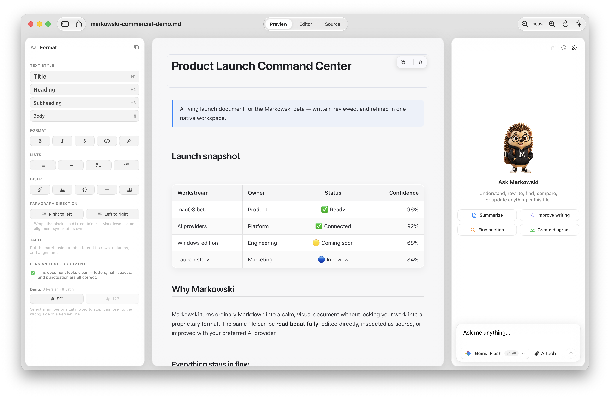
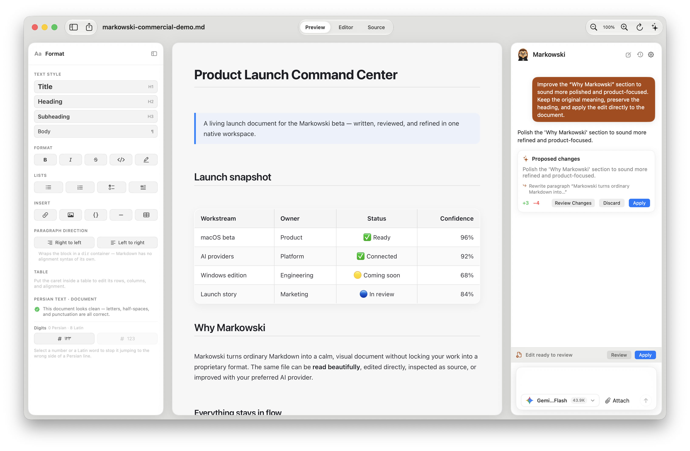
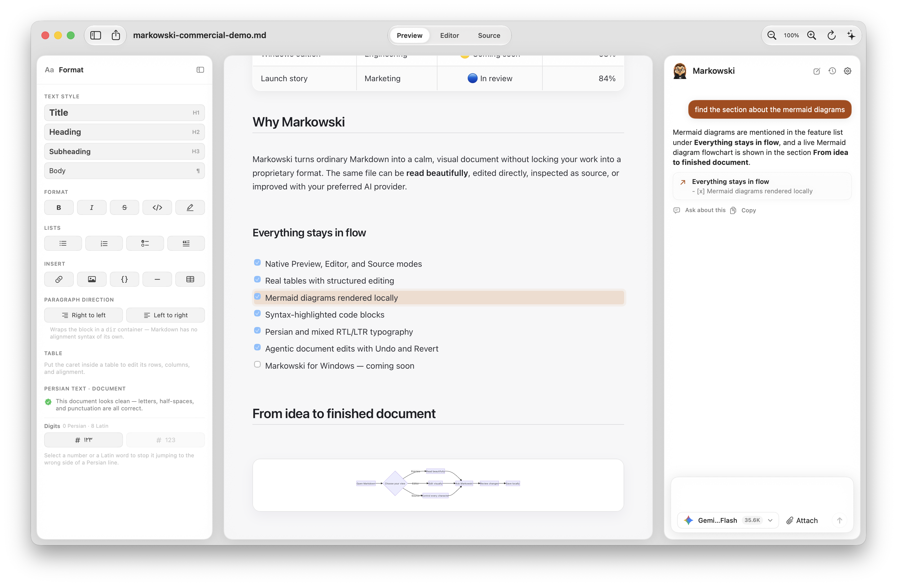
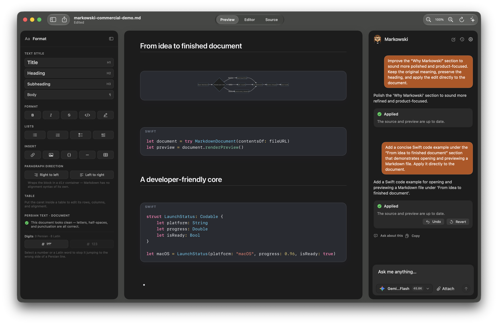

<div align="center">


# Markowski

### Markdown that feels like a document.

**A native macOS workspace for reading, editing, and improving Markdown—with your preferred AI provider beside the document.**

[](https://github.com/smSamani/markowski-site/releases/download/v1.0.0-beta.1/Markowski-1.0.0-beta.1.dmg)
&nbsp;
[](#requirements)
&nbsp;
[](#windows)

<sub>Free public beta · Native SwiftUI · Local Markdown files · Bring your own AI key</sub>

</div>

---

<div align="center">

</div>

## One file. Three ways to work.

Markowski keeps ordinary `.md` files at the centre of the experience. Read a polished preview, edit the document visually, or inspect the original Markdown source—without converting your work into a proprietary format.

- **Preview** for calm, publication-ready reading
- **Editor** for direct visual formatting, tables, lists, and mixed RTL/LTR content
- **Source** for the raw Markdown whenever you want full control
- **Autosave** to the file you already own

## An assistant that works with the document

Ask Markowski to summarize, rewrite, find a passage, create a diagram, or carefully edit the open file. Proposed changes stay reviewable, with Undo and Revert available after an agentic edit.

<div align="center">

</div>

### Smart navigation

Answers can point back to the passage they came from. Open a citation and Markowski moves the document to the matching section—even when the reference belongs to rendered content such as a Mermaid diagram.

<div align="center">

</div>

### Agentic edits you can trust

The assistant can update the source and refresh the preview as one operation. Applied changes are clearly reported and remain reversible.

<div align="center">

</div>

## Bring the models you already use

Connect Gemini, OpenAI, Anthropic, OpenRouter, Mistral, Groq, xAI, or DeepSeek. Only providers with a saved API key appear in the composer, and you choose which text-capable models are available.

Per-model controls include usage counters, editable token limits, manual or daily reset schedules, and reasoning effort where the provider supports it. API keys are stored in macOS Keychain.

<div align="center">

</div>

## Built for real Markdown

- Visual headings, lists, task lists, blockquotes, links, images, and tables
- Syntax-highlighted code blocks
- Mermaid diagrams rendered locally
- Persian typography with IRANSansX and resilient mixed RTL/LTR layout
- Editable source mode with a stable colour system
- PDF, Word, spreadsheet, image, and code attachments for supported models
- Searchable model selector and provider-specific model controls
- No account required and no document upload until you press Send

## Install

1. [Download **Markowski 1.0 Beta**](https://github.com/smSamani/markowski-site/releases/download/v1.0.0-beta.1/Markowski-1.0.0-beta.1.dmg).
2. Open the DMG.
3. Drag **Markowski** onto the **Applications** folder.
4. On first launch, right-click Markowski and choose **Open**.

The beta is ad-hoc signed but not yet notarized by Apple, so macOS may request confirmation on first launch.

### Requirements

- macOS 14 Sonoma or later
- Apple Silicon or Intel Mac
- An API key only for AI features; reading and editing remain local

## Build from source

```bash
git clone https://github.com/smSamani/markowski.git
cd markowski
xcodebuild -project MarkView.xcodeproj -scheme MarkView -configuration Release build
```

## Windows

The Windows edition is in development and will be released later. **Coming soon.**

---

<div align="center">

### Keep the Markdown. Lose the friction.

**[Download Markowski Beta](https://github.com/smSamani/markowski-site/releases/download/v1.0.0-beta.1/Markowski-1.0.0-beta.1.dmg)** · [Visit the product site](https://smsamani.github.io/markowski-site/)

</div>
