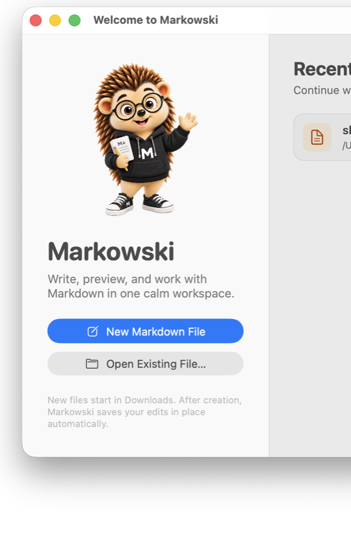
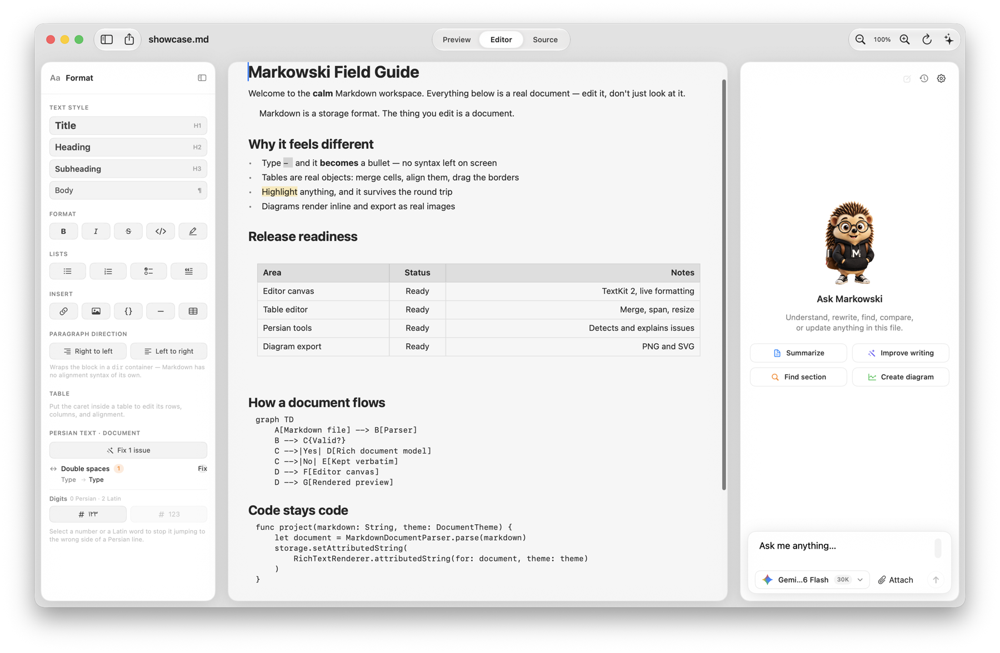
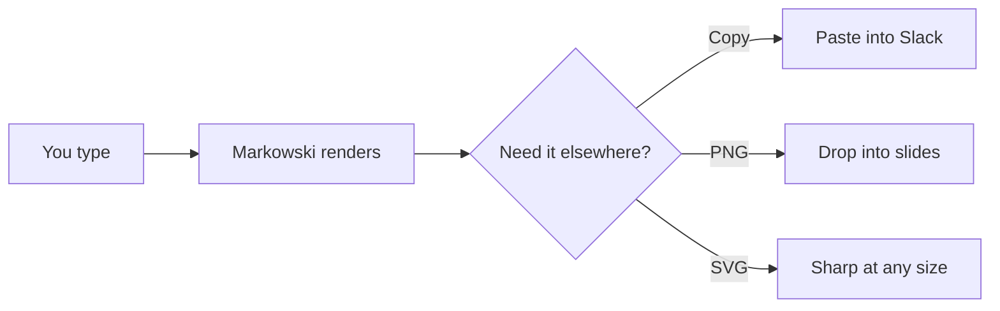
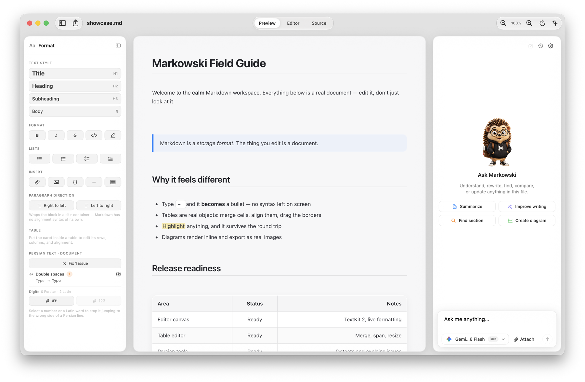

<div align="center">



# Markowski

### Markdown, without the Markdown.

**A native macOS editor where `##` becomes a heading, `|` becomes a table you can actually drag, and the syntax gets out of your way.**

[](../../releases/latest)
&nbsp;
[](#requirements)
&nbsp;
[](#built-like-it-matters)

<sub>Free public beta · Apple Silicon & Intel · ~11 MB</sub>

</div>

---

## The problem with every other Markdown editor

You have two bad options.

| | The "raw text" editor | The "preview pane" editor | **Markowski** |
|---|---|---|---|
| What you look at | `## Heading` | `## Heading` *and* Heading | **Heading** |
| Editing a table | Aligning pipes by hand | Aligning pipes by hand | Drag the column border |
| Merging two cells | Not possible | Not possible | Click merge |
| Your eyes | Doing the rendering | Ping-ponging between panes | Reading a document |

You either stare at punctuation, or you stare at punctuation *next to* the thing it makes.

**Markowski takes a third option: the document is the editor.** Markdown is how the file is *stored*, not what you look at while you work.

<div align="center">

<br><sub><b>Editor mode.</b> Real headings, a real table, a real highlight. No syntax anywhere on screen — and it saves as ordinary Markdown.</sub>
</div>

---

## Why you'll actually keep it

### ⌨️ It types like a word processor, saves like a text file

Type `- ` and you get a bullet — the dash is gone, because it was never content. Same for `# `, `1. `, `> `, `[] `, and ` ``` `. **⌘B**, **⌘I**, **⌘K** work where your fingers expect. Tab indents a list item instead of inserting a tab character.

Then it saves as `.md`. Open it in any other editor and it's clean, ordinary Markdown.

### 📊 Tables you can actually use

This is where most Markdown editors give up.

- **Drag a column border** to resize it
- **Merge cells** across rows and columns
- **Align per cell** — horizontally *and* vertically
- **Arrow keys move between rows**, Tab moves between cells, Tab at the end grows the table
- Row and column handles with insert / move / delete

> **The clever bit:** Markdown can't express a merged cell. So a plain table stays plain Markdown — and only a table that actually *needs* more quietly becomes an HTML table. You never lose data, and you never get HTML you didn't ask for.

### 🎨 A toolbar that follows your cursor

Select anything and a formatting bar appears over it — block style, bold, italic, code, highlight, link, and **✦ Ask** to hand that exact selection to the assistant.

### 📈 Diagrams that leave the building

Write a Mermaid diagram, get a rendered diagram. Then hover it and take it with you — **Copy**, **PNG**, or **SVG**. Exported at 2× and pixel-identical to what's on screen.



### 🌍 Persian and RTL, taken seriously

Not an afterthought. Markowski **scans your document and tells you what's actually wrong** — how many Arabic `ي` should be Persian `ی`, how many missing نیم‌فاصله — with a worked example of each fix, because these changes are invisible on screen.

It also knows to leave your code blocks and your English punctuation alone.

### ✦ An assistant that can see your document

Ask about the file you're in. Attach **PDFs, Word documents, Excel sheets, and code** — Markowski reads the text out of them locally and shows you exactly what the model will see. Chats are saved, searchable, and **deletable**, with a storage panel that tells you what your attachments actually cost and reclaims the space when you delete them.

<div align="center">

<br><sub><b>Preview mode.</b> Rendered document, formatting panel on the left, assistant on the right.</sub>
</div>

---

## Three views of the same file

<div align="center">

| **Preview** | **Editor** | **Source** |
|:---:|:---:|:---:|
| Rendered, polished, ready to read | Edit the document directly | The raw Markdown, when you want it |

</div>

Switch with the segmented control at the top. Your scroll position and selection survive the trip.

---

## Install

<div align="center">

### [⬇️ Download Markowski Beta](../../releases/latest)

</div>

1. Open the `.dmg` and drag **Markowski** to **Applications**
2. **First launch:** right-click the app → **Open** → **Open**

<details>
<summary><b>Why does macOS warn me the first time?</b></summary>

<br>

This beta isn't notarised by Apple yet, so Gatekeeper asks for confirmation the first time. Right-click → Open tells macOS you meant it. You only do this once.

If you'd rather not, that's completely reasonable — you can also build it yourself:

```bash
git clone <this-repo>
cd "MD preview"
xcodebuild -project MarkView.xcodeproj -scheme MarkView -configuration Release build
```

</details>

### Requirements

- macOS 14 (Sonoma) or later
- Apple Silicon or Intel
- An API key **only** if you want the assistant — everything else works offline, forever, with no account

---

## Built like it matters

This is a beta, but it isn't a prototype.

<div align="center">

| | |
|---:|:---|
| **256** | tests, all passing |
| **0** | telemetry, accounts, or phone-home |
| **100%** | of your files stay on your Mac |
| **TextKit 2** | the modern text engine, not a web view |

</div>

Documents are parsed into a real block model, not regex'd. The round trip from Markdown → document → Markdown is covered by tests specifically so that editing a file can never quietly corrupt the parts you didn't touch.

---

## Honest about the beta

Things that work well: editing, tables, diagrams, Persian tools, file attachments, chat history.

Things to know:
- Not notarised yet (see above)
- The assistant needs your own API key — Gemini, OpenAI, or Anthropic
- Collaborative editing and a plugin API aren't built yet

Found something broken? [**Open an issue**](../../issues/new) — a description plus the file it happened in is the most useful thing you can send.

---

<div align="center">


### Stop looking at punctuation.

**[Download the beta](../../releases/latest)** and open something you're already writing.

<sub>Made for people who write a lot of Markdown and would rather not see it.</sub>

</div>
