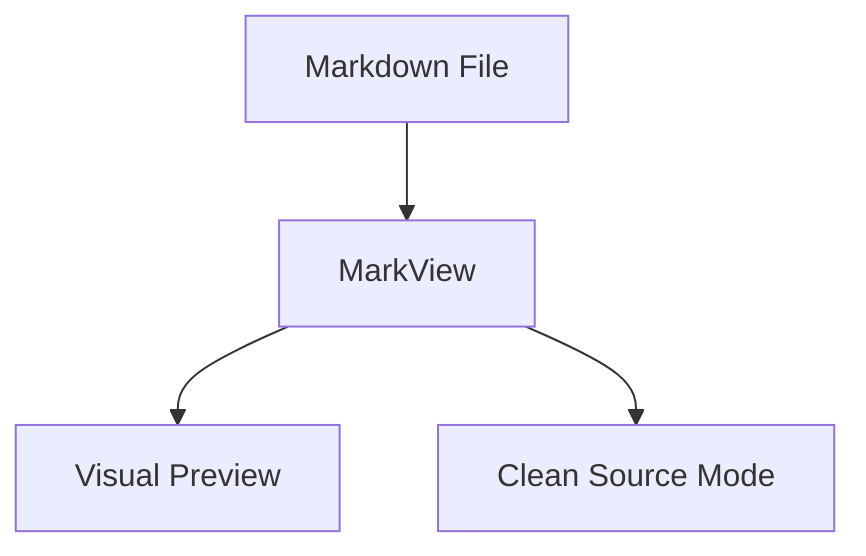

# MarkView Complete Markdown Feature Test

This document tests the full Markdown feature set supported by **MarkView**.

## Formatting Showcase

Here is a paragraph containing **bold text**, *italic text*, ***bold italic***, ~~strikethrough~~, and `inline code`.

### Headings (H3)
#### Heading 4
##### Heading 5
<h6>Heading 6</h6>

---

## Lists & Tasks

### Unordered List
* Apple
* Banana
  * Sub-item A
  * Sub-item B
* Cherry

### Ordered List 
3. Initial step
2. Subsequent step
1. Final step

### Task List
- [x] Create native macOS app shell
- [x] Support GFM Markdown
- [x] Offline Mermaid diagram rendering
- [ ] Add touch bar support (optional)

---

## Blockquotes

> "Simplicity is about subtracting the obvious and adding the meaningful."
> — John Maeda

> Nested blockquotes work seamlessly as well.
>> Second level indentation.

---

## Tables

| Feature | Support Level | Speed | Native UI |
| :--- | :---: | :---: | ---: |
| Markdown Rendering | Full | Instant | Yes |
| Mermaid Diagrams | Full | Instant | Yes |
| External Refresh | Auto | Real-time | Yes |

---

## Code Blocks

```swift
import SwiftUI

struct DocumentView: View {
    let title: String
    
    var body: some View {
        Text("Rendering: \(title)")
            .font(.title)
            .padding()
    }
}
```



---

## Links & Images

Check out the [Apple Developer Site](https://developer.apple.com).


---

End of document test.
