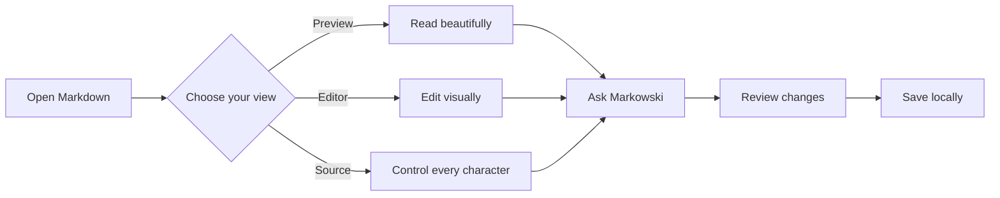

# Product Launch Command Center

> A living launch document for the Markowski beta — written, reviewed, and refined in one native workspace.

## Launch snapshot

| Workstream | Owner | Status | Confidence |
|:--|:--|:--:|--:|
| macOS beta | Product | ✅ Ready | 96% |
| AI providers | Platform | ✅ Connected | 92% |
| Windows edition | Engineering | 🟡 Coming soon | 68% |
| Launch story | Marketing | 🔵 In review | 84% |

## Why Markowski

Markowski turns ordinary Markdown into a calm, visual document without locking your work into a proprietary format. The same file can be **read beautifully**, edited directly, inspected as source, or improved with your preferred AI provider.

### Everything stays in flow

- [x] Native Preview, Editor, and Source modes
- [x] Real tables with structured editing
- [x] Mermaid diagrams rendered locally
- [x] Syntax-highlighted code blocks
- [x] Persian and mixed RTL/LTR typography
- [x] Agentic document edits with Undo and Revert
- [ ] Markowski for Windows — coming soon

## From idea to finished document



## A developer-friendly core

```swift
struct LaunchStatus: Codable {
    let platform: String
    let progress: Double
    let isReady: Bool
}

let macOS = LaunchStatus(platform: "macOS", progress: 0.96, isReady: true)
```

- 


## Built for multilingual teams

<div dir="rtl">

### تجربه‌ای طبیعی برای نوشتن فارسی

مارکوفسکی متن فارسی و انگلیسی را هوشمندانه کنار هم نمایش می‌دهد؛ جهت متن، نیم‌فاصله، نشانه‌گذاری و فونت فارسی بدون به‌هم‌ریختگی مدیریت می‌شوند.

</div>

---

### One document. Every stage of the work.

Private by default · Local-first · Your models · Your Markdown
