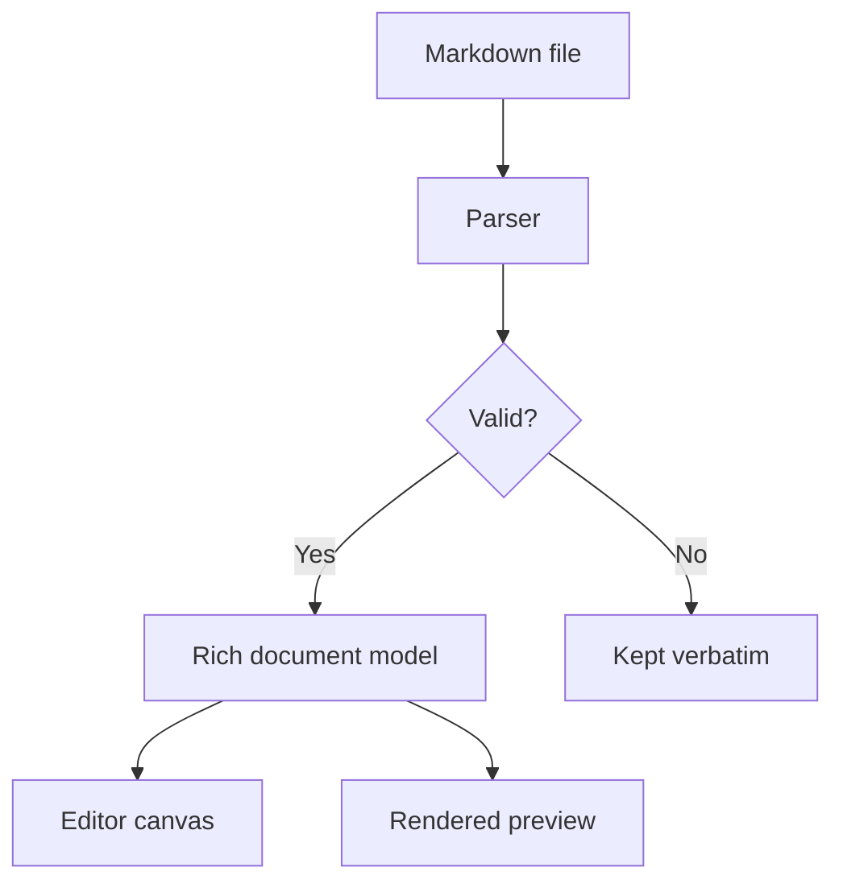

# Markowski Field Guide

Welcome to the **calm** Markdown workspace. Everything below is a real document — edit it, don't just look at it.

> Markdown is a *storage format*. The thing you edit is a document.

## Why it feels different

- Type `- ` and it **becomes** a bullet — no syntax left on screen
- Tables are real objects: merge cells, align them, drag the borders
- ==Highlight== anything, and it survives the round trip
- Diagrams render inline and export as real images

## Release readiness

| Area | Status | Notes |
| :--- | :---: | ---: |
| Editor canvas | Ready | TextKit 2, live formatting |
| Table editor | Ready | Merge, span, resize |
| Persian tools | Ready | Detects and explains issues |
| Diagram export | Ready | PNG and SVG |

## How a document flows



## Code stays code

```swift
func project(markdown: String, theme: DocumentTheme) {
    let document = MarkdownDocumentParser.parse(markdown)
    storage.setAttributedString(
        RichTextRenderer.attributedString(for: document, theme: theme)
    )
}
```

## Written in any direction

<div dir="rtl" markdown="1">

نوشتن فارسی در مارکوفسکی روان است. نیم‌فاصله، اعداد فارسی و نشانه‌گذاری درست به‌صورت خودکار بررسی می‌شوند.

</div>

## What's next

- [x] Rich editing canvas
- [x] Table merging and alignment
- [ ] Collaborative editing
- [ ] Plugin API

---

Built for people who write a lot of Markdown and would rather not look at it.
