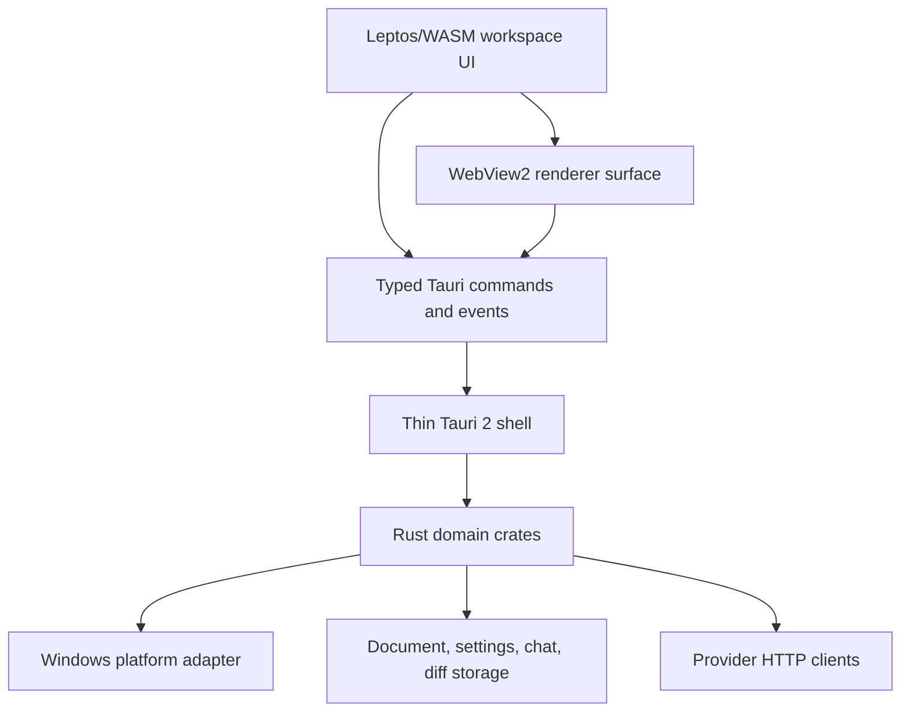

# Markowski Windows Architecture Freeze

Status: PROPOSED / FROZEN FOR PHASE 0 — this is a boundary and contract
document, not an implemented workspace. The design follows the master plan’s
Rust stable, Tauri 2, Leptos/WASM, and WebView2 direction while keeping all
unproven pieces explicitly provisional.

## Architectural goals

The Windows application must:

1. keep Markdown source as the durable document authority;
2. operate locally without an account, mandatory telemetry, or a required AI
   provider;
3. isolate domain behavior from Tauri, WebView2, Windows APIs, filesystem, and
   network implementations;
4. make AI output untrusted data that becomes a user-reviewed proposal before
   it can mutate a document;
5. preserve the macOS product contract without importing SwiftUI/AppKit
   assumptions into the Rust core;
6. support Windows 11 x64 as the release baseline and prove ARM64 before a GA
   claim, as specified by the master plan.

## System shape



The UI and renderer are untrusted at the boundary. The shell validates command
arguments and capability scope; domain crates validate document operations and
conflict state; platform adapters perform only the approved native operation.

## Proposed repository shape

The following is a target layout for a later phase. Phase 0 intentionally does
not create it:

```text
windows/
  Cargo.toml
  apps/
    desktop-ui/              # Leptos/WASM frontend
    shell/                    # Tauri bootstrap, commands, capabilities
  crates/
    core/                     # pure domain state and invariants
    document/                 # source snapshots, encoding, identity, save state
    markdown/                 # parser, serializer, block ranges, Mermaid metadata
    navigation/               # index, location, search, bridge DTOs
    ai/                       # providers, stream, model catalog, proposals
    diff/                     # bounded deterministic diff
    storage/                  # documents, settings, chats, attachments
    security/                 # redaction, hashes, secret interface
    platform-windows/         # Credential Manager, watcher, shell/open APIs
    test-support/             # fixtures, fake clock, fake provider, temp files
  tests/
    golden/
    e2e/
  assets/
    renderer/
  scripts/
```

The exact workspace names can change in Phase 1, but the dependency direction
cannot: `core`, `document`, `markdown`, `navigation`, `ai`, and `diff` must not
depend on Tauri, Leptos, WebView2, Win32, or concrete HTTP/filesystem APIs.

## Layer contracts

### `core`

Owns document session state, edit transactions, proposal state, conflict state,
and user-visible errors. It receives traits and immutable snapshots. It does not
read files, call providers, inspect Windows, or serialize UI state.

### `document`

Owns UTF-8/BOM/line-ending policy, document identity, source snapshots, file
metadata, SHA-256 hashes, autosave state, and external-change transitions. It
must distinguish:

- current in-memory source;
- last persisted source;
- file bytes and file identity at read time;
- a missing, unreadable, renamed, or permission-denied file;
- a stale AI proposal.

The save API must return a typed result with the new hash and identity. A failed
read is never equivalent to “unchanged”.

### `markdown`

Owns parsing, block ranges, semantic rich-document representation, Markdown
serialization, Mermaid fence recognition, source/render mapping, and Persian
direction metadata. Parsing and serialization must be deterministic and testable
without a WebView. Raw or unsupported blocks are retained with explicit fidelity
metadata rather than discarded.

The design has two fidelity tiers:

- **Source tier:** edits that promise exact bytes outside an intentional range;
- **Semantic tier:** editor operations that may normalize the model and output.

The UI must show which tier an operation uses. A semantic round trip is not
allowed to masquerade as byte preservation.

### `navigation`

Owns block IDs, headings, quotes, source line/range locations, search match
semantics, and typed renderer bridge DTOs. It does not evaluate arbitrary script
strings or know the WebView implementation.

### `ai`

Owns provider traits, provider registry, model discovery, capability metadata,
stream events, cancellation, token accounting, attachments, request context,
operation schema validation, and proposal creation. It receives a document
snapshot and returns events/data. It cannot mutate the live document directly.

Every proposal includes:

```text
proposal_id
base_document_hash
base_file_identity (when applicable)
base_memory_revision
original_source
updated_source
typed_change_summary
validation_result
```

Apply requires a fresh comparison of all available base values. “Apply anyway”
is not a default escape hatch; a deliberate rebase creates a new proposal and
diff.

### `diff`

Owns deterministic line and range diffing, common-prefix/suffix optimization,
bounded memory behavior, and a large-file fallback. It does not decide whether
an edit is safe to apply.

### `storage`

Owns document files, app-data preferences, chat sessions, attachment blobs,
atomic writes, schema versions, migrations, and garbage collection. It exposes
typed interfaces and redacted errors; it does not put API keys or document
content into ordinary logs.

### `security`

Owns hashing, secret-storage traits, log redaction, safe path checks, content
policy, capability expectations, and security-sensitive validation. The
Windows implementation must use Credential Manager through a narrow adapter,
and must return an error when secure storage is unavailable instead of falling
back to reversible application storage.

### `platform-windows`

Owns Windows Credential Manager, file watcher implementation, file association
and shell open operations, path canonicalization, long-path behavior, DPI/IME
hooks, and native process/installer integration. The rest of the application sees
traits and typed errors, not Win32 handles or registry strings.

### Tauri shell

Owns application bootstrap, window lifecycle, typed commands/events, capability
configuration, lifecycle logging, and translation between UI DTOs and domain
types. Business rules do not live in commands. Every command has an allowlisted
name, narrow input schema, validation, and an explicit error mapping.

## Typed IPC contract

The initial command/event families are:

| Family | Examples | Direction | Required policy |
| --- | --- | --- | --- |
| Documents | `open_document`, `save_document`, `reload_document`, `watch_document` | UI → Rust; Rust → events | Validate path scope, revision, hash, file identity |
| Navigation | `search_document`, `resolve_location`, `scroll_to_location` | Both | Pass structured ranges; no concatenated JavaScript |
| Rendering | `render_snapshot`, `renderer_selection`, `renderer_action` | Both | Renderer messages are untrusted and origin-checked |
| AI | `discover_models`, `start_request`, `cancel_request`, `review_proposal`, `apply_proposal` | Both | Explicit send; stream IDs; no direct document mutation |
| Settings | `get_settings`, `set_model_policy`, `set_theme` | Both | No secret values in response/log DTOs |
| Platform | `open_external`, `pick_file`, `credential_status` | UI → Rust | Narrow allowlist, user confirmation where needed |

Commands that read or write files must take a document-session handle and an
expected revision. A command with only an arbitrary path and replacement string
is not an acceptable document API.

## Renderer strategy

Phase 0 recommends reusing the product’s Markdown/Mermaid behavioral corpus and
bundled renderer assets only after a Windows security audit. The renderer may be
a WebView2 surface inside Tauri or a Leptos view with a small local rendering
island, but it must satisfy the same contracts:

- bundle-only scripts and styles;
- strict CSP including the WASM requirement;
- no network requests during offline render;
- sanitized/explicit raw HTML policy;
- Mermaid configuration that does not enable unsafe HTML/script behavior;
- local image URLs resolved only through a document-root allowlist;
- typed `postMessage`/Tauri events, not interpolated source strings;
- navigation blocked or confirmed for non-approved origins.

The current macOS `renderer.html` is evidence for behavior and fixtures, not a
security configuration to copy unchanged.

## Document safety and save transaction

The Windows save sequence is frozen as a design requirement:

1. capture the session revision, source bytes, hash, and file identity;
2. validate encoding and destination scope;
3. write a temporary file in the same directory with restrictive ACLs;
4. flush and close the temporary file;
5. atomically replace the target, preserving a recoverable backup if policy
   requires it;
6. re-read/verify hash and identity, then publish the new session revision;
7. emit a typed save result and watcher self-write token.

External changes arriving between steps are conflicts, not silent overwrites.
The implementation must define behavior for rename, delete, permission denial,
network/removable volumes, reparse points/symlinks, long paths, and concurrent
writes.

## Persistence boundary

| Data | Windows location/policy | Secret/content rule |
| --- | --- | --- |
| Open documents | User-selected filesystem path | Source remains user-owned; no shadow cloud copy |
| Preferences | Roaming or local app data, schema-versioned | No API keys or full document content |
| Chat sessions | Local app data, atomic JSON/SQLite decision in Phase 1 | User-controlled retention; redact logs |
| Attachments | Content-addressed local blob store with GC | Enforce size/type/dimension limits |
| API keys | Windows Credential Manager | No Base64/UserDefaults fallback |
| Logs | Local app data with rotation | Redact tokens, cookies, auth headers, document text, prompts, and raw provider payloads |

## Release and support implications

The runtime and build support matrix is in
[`WINDOWS_SUPPORT_MATRIX.md`](WINDOWS_SUPPORT_MATRIX.md). Tauri documentation
requires Microsoft C++ Build Tools and WebView2 for Windows development and
recommends the MSVC Rust host. The current host does not prove those prerequisites,
so this architecture remains `PROPOSED` until a disposable smoke build passes.

## Architecture exit criteria

Before Phase 1 starts, a clean Windows build must prove:

- the proposed shell/core boundary compiles;
- a local window starts with the declared CSP/capabilities;
- a typed command/event round trip works;
- a document can be opened, edited, saved, watched, and conflict-tested;
- WebView2/renderer assets load offline;
- the first golden Markdown/Mermaid corpus matches the parity contract;
- no secret reaches logs or ordinary storage;
- the Phase 0 acceptance matrix has no mandatory `BLOCKED` item.
